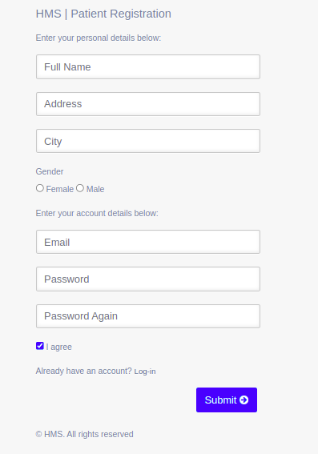
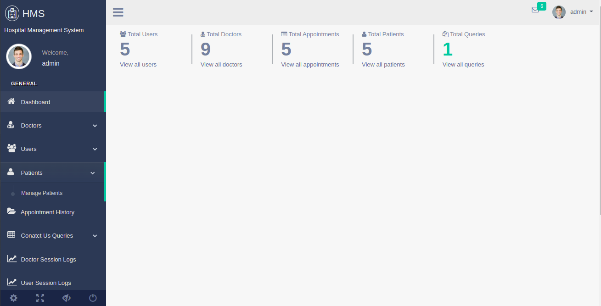
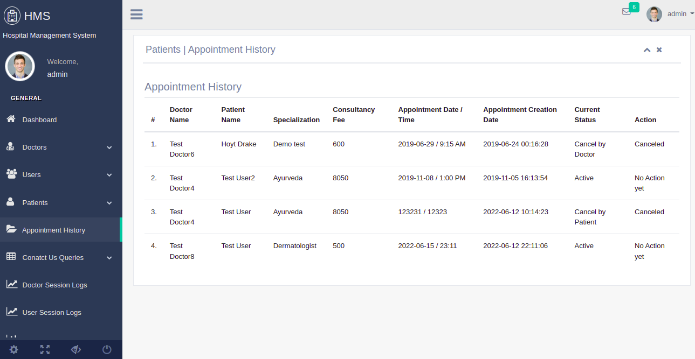

##### Hospital Management System(HMS) Introduction

Hospital Management System In PHP is web baes application.

The project Hospital Management system includes registration of patients, storing their details into the system. The software has the facility to give a unique id for every patient and stores the details of every patient. This system helps manage the information related to health care and aids in the job completion of health care providers effectively.

The Hospital Management System can be entered using a username and password. It is accessible either by an administrator .Only they can add data into the database. The data can be retrieved easily. The interface is very user-friendly. The data are well protected for personal use and make the data processing very fast.

##### Project Requirements

| Project Name      | Language Used | Database | User Interface Design | Web Browser | Software |
| ----------- | ----------- |----------- |----------- |----------- | ----------- |
| Hospital Management System(HMS)      | PHP5.6, PHP7.x       | MySQL 5.x | HTML, AJAX,JQUERY,JAVASCRIPT| Mozilla, Google Chrome, IE8, OPERA | XAMPP / Wamp / Mamp/ Lamp (anyone) |

##### Project Modules

Hospital Management System is a web application for the hospital which manages doctors and patients. In this project, we use PHP and MySQL database.
The entire project mainly consists of 3 modules, which are

*   Admin module
*   User module
*   Doctor module

**Admin module:**

1.  **Dashboard:** In this section, admin can view the Patients, Doctors, Appointments and New queries.
2.  **Doctors:** In this section, admin can add doctor’s specialization and mange doctors (Add/Update).
3.  **Users:** In this section, admin can view users detail(who take online appointment) and also have right to delete irrelevant user.
4.  **Patients:** In this section, admin can view patient’s details.
5.  **Appointment History:** In this section, admin can view appointment history.
6.  **Contact us Queries:** In this section, admin can view queries which are send by users.
7.  **Doctor Session Logs:** In this section, admin can see login and logout time of doctor.
8.  **User Session Logs:** In this section, admin can see login and logout time of user.
9.  **Reports:** In this section, admin can view reports of patients in particular periods.
10.  **Patient Search:** In this section, admin can search patient with the help of patient name and mobile number.

Admin can also change his/her own password.
**User module (patient):**

1.  **Dashboard**: In this section, patients can view the his/her profile, Appointments and Book Appointment.
2.  **Book Appointment:** In this section, Patient can book his/her appointment.
3.  **Appointment History:** In this section, Patients can see his/her own appointment history.
4.  **Medical History:** In this section, Patients can see his/her own appointment history.

User can update his/her profile, change the password and recover the password.
**Doctor module:**

1.  **Dashboard:** In this section, doctor can view his/her own profile and online appointments.
2.  **Appointment History:** In this section, Doctor can see patient’s appointment history.
3.  **Patients:** In this section, doctor can manage patients (Add/Update).
4.  **Search:** In this section, doctor can search patient with the help of patient name and mobile number.

Doctor can also update his profile, change the password and recover the password.

* * *

##### Project Output Screens

* * *

**Patient Registration**

**Admin Dashboard**

**Appointments History**

##### How to run the Hospital Management System (HMS) Project

1\. Download the zip file
2\. Extract the file and copy hospital folder
3.Paste inside root directory(for xampp xampp/htdocs, for wamp wamp/www, for lamp var/www/html)
4\. Open PHPMyAdmin (http://localhost/phpmyadmin)
5\. Create a database with name hms
6\. Import hms.sql file(given inside the zip package in SQL file folder)
7.Run the script http://localhost/hospital (frontend)

**Login Details**
- Login Details for admin : admin/1234 (http://localhost/hospital/admin)
- Login Details for Patient: test@user.com/1234 (http://localhost/hospital/doctor)
- Login Details for Doctor: test@doctor.com/1234 (http://localhost/hospital)

